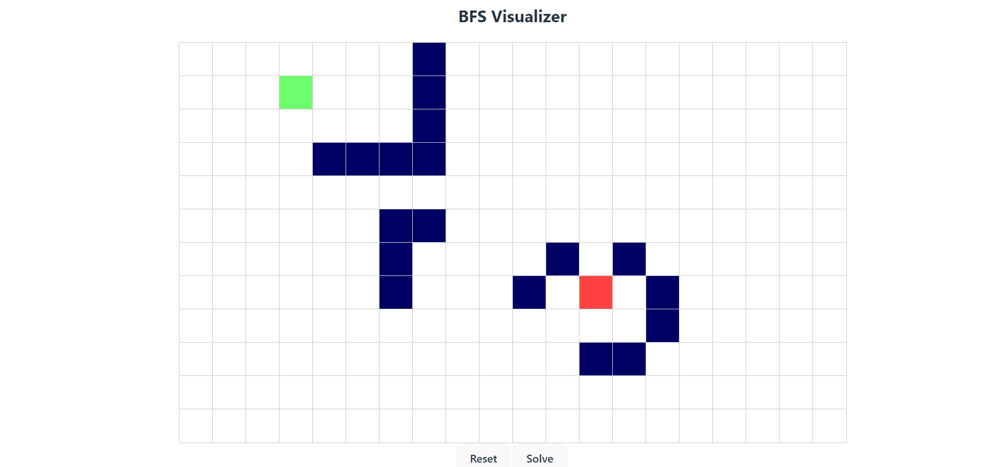

# About this project

This project visualizes the BFS (Breadth-first search) using React.

To see the visualization click a cell to define a start and an end point. Once defined, any further clicks will create walls in the grid, that the algorithm will try to avoid.

# Showcase

